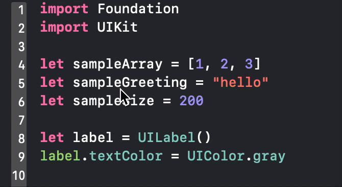

# AddNextEt
Xcode Source Editor Extentsion

add next selection like Sublime Text and VSCode;

## Example

(Getting Ready)

# Install

### easy way
1. Download `AddNext.dmg` from https://github.com/sidepelican/AddNextEx/releases
1. Open `.dmg` and drag `AddNext.app` to your Applications folder
1. Run `AddNext.app` and exit again.
1. Go to System Preferences (not Xcode) -> Extensions -> Xcode Source Editor and enable the extension
1. The menu-item should now be available from Xcode's Editor menu.

### build by yourself
1. Open .xcodeproj
1. Enable target signing for both the Application and the Source Code Extension using your own developer ID
1. Product > Archive
1. Right click archive > Show in Finder
1. Right click archive > Show Package Contents
1. Open Products, Applications
1. Drag `AddNext.app` to your Applications folder
1. Run `AddNext.app` and exit again.
1. Go to System Preferences (not Xcode) -> Extensions -> Xcode Source Editor and enable the extension
1. The menu-item should now be available from Xcode's Editor menu.

# Licence
The MIT License. See the LICENSE file for more infomation.
